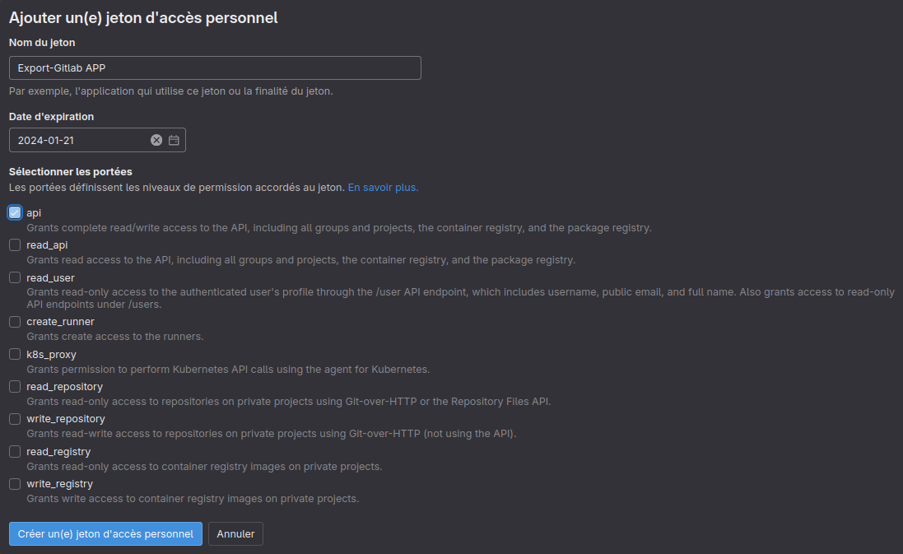
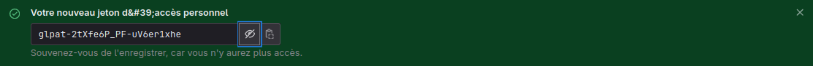
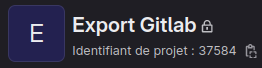

# Documentation Export-GitLab

## Description

L'application Export-GitLab simplifie l'exportation des issues d'un projet, permettant de les télécharger au format PDF.

### Première utilisation

__Site : [Export-GitLab](https://export-gitlab.app.unistra.fr)__

Pour utiliser l'application, vous devez renseigner le token utilisateur de GitLab. Voici les étapes :

1. Allez sur le site de GitLab de l'Unistra, puis accédez aux préférences (Cliquez sur l'icône de votre profil, puis sur le bouton "Préférences"). Ensuite, accédez à la section "Jetons d'accès" ou "Access Token".
    *Accès direct* : https://git.unistra.fr/-/profile/personal_access_tokens

2. Cliquez sur "Ajouter un nouveau jeton". Une interface apparaîtra.

3. Nommez le jeton (ex. Export-GitLab App). Et Choisissez une date d'expiration selon vos préférences. (La date par défaut est d'un mois)

4. Cochez uniquement l'option "api" pour générer le token.
   

5. Copiez le token généré.
   __ATTENTION Assurez-vous de sauvegarder le token quelque part, car il sera impossible de le récupérer ultérieurement.__
   

6. Accédez au site Export-GitLab (vous serez redirigé vers votre profil par défaut si aucun token n'est enregistré) et collez-le dans le champ correspondant.

## Utilisation

L'application comporte 3 interfaces :

1. La page de profil utilisateur : la première page affichée lors de la première connexion. Elle permet de renseigner/modifier/supprimer votre token.

2. La page principale, une fois le token renseigné : affiche un tableau de tous les projets déjà intégrés dans la base de données. Vous pouvez y ajouter les projets accessibles via leur ID et les rechercher par nom.
   
   

3. La dernière page, une fois le projet sélectionné : affiche toutes les issues du projet actuellement ouvert. Il est possible de les filtrer par :
    *   statut
    *   labels
    * ID (séparés par une virgule). 

4. Une fois les issues sélectionnées, vous pourrez les télécharger soit en un document PDF unique, soit individuellement dans un fichier zip.

## Informations Complémentaires

Contact : lmerkel@unistra.fr
